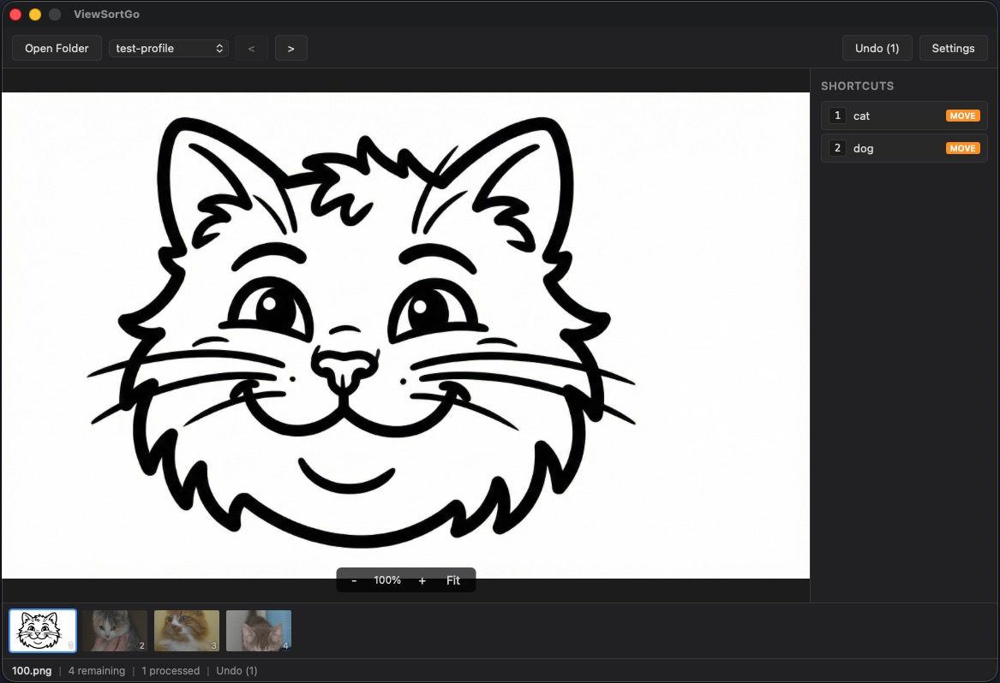

# ViewSortGo

A lightweight desktop app for reviewing and annotating image datasets using keyboard shortcuts.

Built with [Wails v2](https://wails.io/) (Go + React/TypeScript).



## Features

### Sorting and Labeling

- **Action types**: copy, move, or label per shortcut; a profile-level action type overrides all shortcuts at once
- **Label mode**: single (one keypress applies immediately) or multi (accumulate multiple labels then confirm)
- **Label output**: centralize JSON sidecar files in one folder with optional subfolder templates using `{parent1}`, `{parent2}`, ... placeholders
- **Quick label creation**: add a new label shortcut on the fly from the viewer

### Navigation

- **Thumbnail strip**: scrollable row for quick visual navigation
- **Pending / All view**: toggle between unannotated images only and all images
- **Filter by label**: show only images annotated with a specific label, with autocomplete from existing labels
- **Go to filename**: jump directly to an image by typing its name

### Profiles

- **Multiple profiles** with duplicate support
- **Function buttons**: custom shell commands per profile, with `$image_path` substitution and optional key bindings

### Viewer

- **Extra image viewer**: show a paired image side-by-side; configure `ExtraImageRoot` and `ExtraImageLinkDepth` to resolve it from a parallel folder tree
- **Info panel**: image dimensions, file size, and EXIF data (camera, lens, ISO, aperture, shutter speed, focal length, date, GPS)
- **Resizable sidebars**: drag to resize the label and info panels

### Other

- **Undo**: reverse the last file operation with Ctrl+Z
- **Annotation tracking**: progress is saved to `.annotations.json` in the working folder
- **Open from Finder**: double-click or "Open With" navigates directly to that image

## Build

Requires [Go 1.21+](https://go.dev/) and [Wails CLI](https://wails.io/docs/gettingstarted/installation).

```sh
wails build
```

```sh
wails dev
```

Pre-built binaries for macOS and Linux are available on the [Releases](../../releases) page.

## License

MIT
